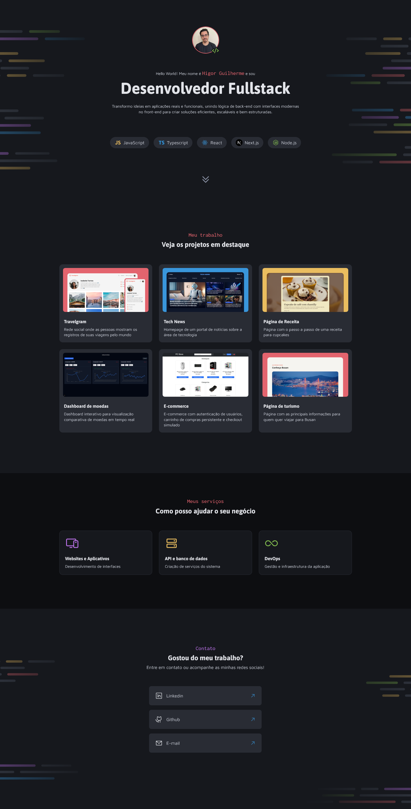

# Portfólio Dev

Portfólio pessoal desenvolvido para apresentar meus projetos, habilidades e formas de contato como desenvolvedor Fullstack.



🔗 **Acesse o site:** [higorgsantana.github.io/Portfolio-Dev](https://higorgsantana.github.io/Portfolio-Dev/)

---

## 📖 Sobre o projeto

Este é o meu portfólio pessoal, construído com **HTML e CSS puros** (sem frameworks), como parte do meu processo de aprendizado e prática de fundamentos de front-end. A página apresenta:

- **Hero** — introdução pessoal, foto e principais tecnologias
- **Projetos em destaque** — cards com os principais projetos desenvolvidos
- **Serviços** — áreas em que posso ajudar (desenvolvimento web, API/banco de dados, DevOps)
- **Contato** — links diretos para LinkedIn, GitHub e e-mail

O layout é totalmente responsivo, adaptado para desktop, tablet e celular.

---

## 🛠️ Tecnologias utilizadas

- **HTML5** — estrutura semântica (`header`, `main`, `section`)
- **CSS3**
  - Custom Properties (variáveis de cor e tipografia)
  - Flexbox e CSS Grid
  - Media Queries (design responsivo)
- **Google Fonts** — Asap, Inconsolata e Maven Pro

---

## 📂 Estrutura do projeto

```
Portfolio-Dev/
├── assets/
│   ├── icons/
│   └── images/
├── styles/
│   ├── global.css
│   ├── utility.css
│   ├── header.css
│   ├── main.css
│   ├── projects.css
│   ├── services.css
│   ├── contact.css
│   └── index.css
└── index.html
```

Cada seção da página tem seu próprio arquivo CSS, importado centralmente pelo `index.css`, facilitando a manutenção e organização do código.

---

## 🚀 Como rodar localmente

```bash
# Clone o repositório
git clone https://github.com/higorgsantana/Portfolio-Dev.git

# Entre na pasta do projeto
cd Portfolio-Dev

# Abra o index.html no navegador
# (ou use a extensão Live Server do VS Code para recarregamento automático)
```

---

## 📬 Contato

- **LinkedIn:** [linkedin.com/in/higorguilherme](https://www.linkedin.com/in/higorguilherme/)
- **GitHub:** [github.com/higorgsantana](https://github.com/higorgsantana)
- **E-mail:** higorgdev@gmail.com

---

Feito com 💻 por **Higor Guilherme**
